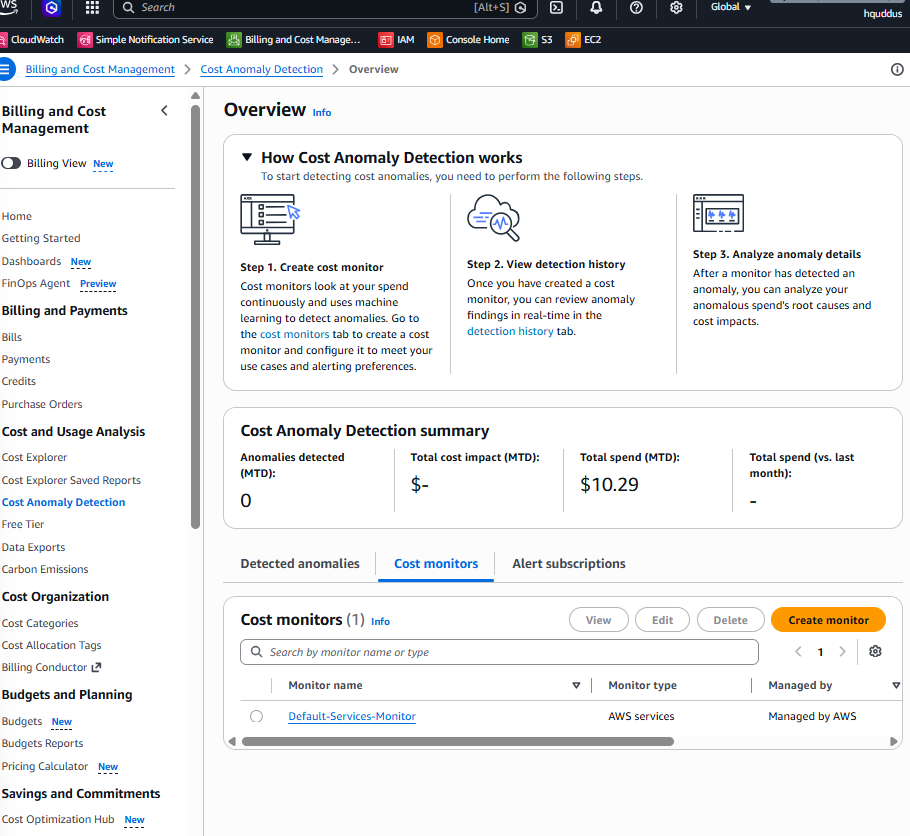
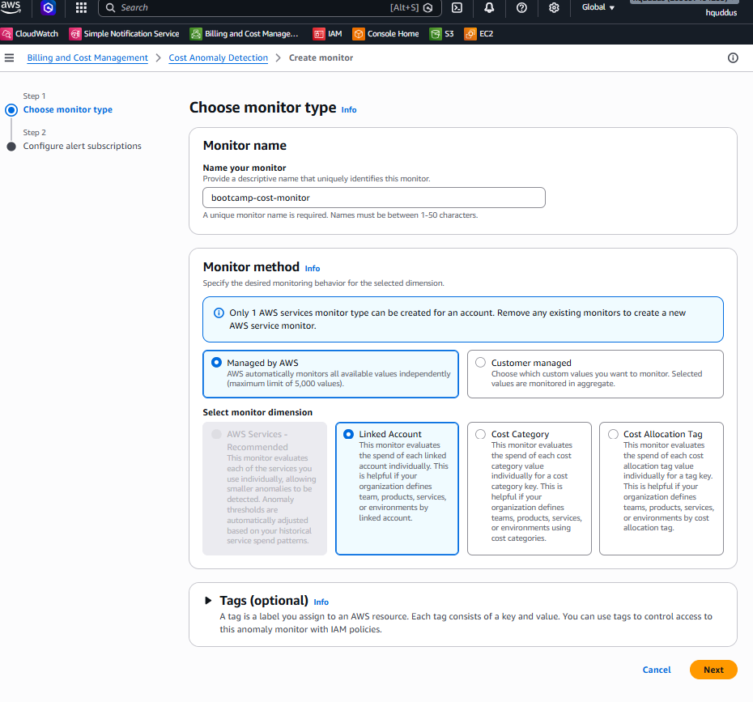
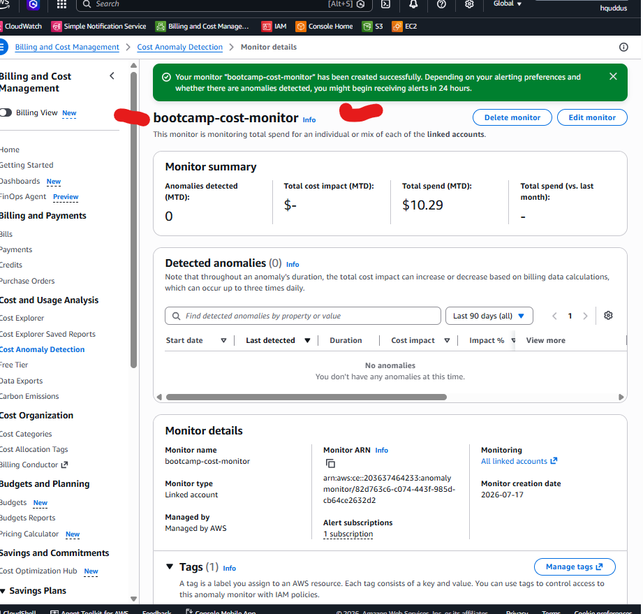
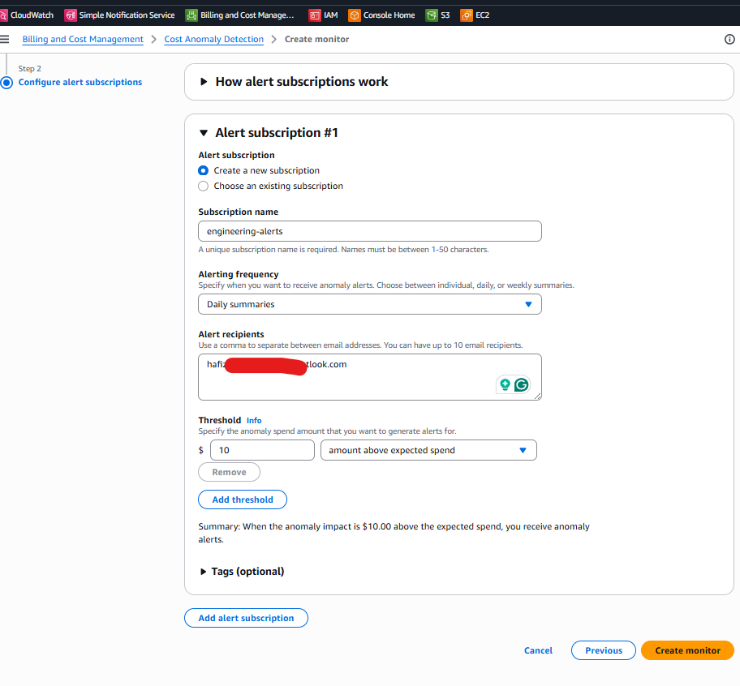
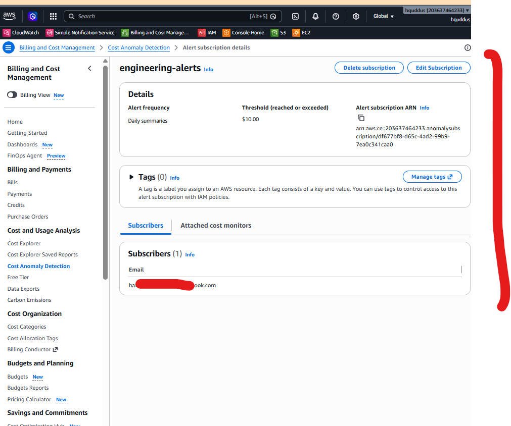
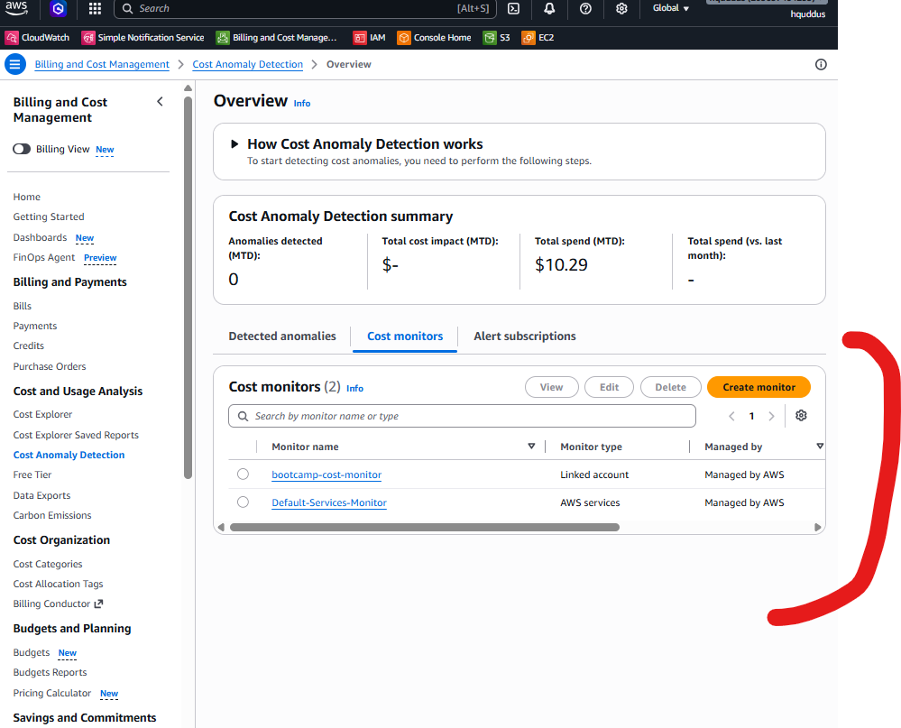

# Lab Solution: Detect Unexpected AWS Costs with AWS Cost Anomaly Detection

**Student Name:** _______________________________________

**Date:** _______________________________________________

**Lab Completion Time:** ____________ minutes

---

# Part 1 – Explore AWS Cost Anomaly Detection

## Questions

### 1. What problem does AWS Cost Anomaly Detection solve?

**Your Answer**

```
_______________________________________________________________

_______________________________________________________________

_______________________________________________________________
```

---

### 2. How is it different from AWS Budgets?

**Your Answer**

```
_______________________________________________________________

_______________________________________________________________

_______________________________________________________________
```

---

## Screenshot 1 – Cost Anomaly Detection Dashboard

Save your screenshot as:

```
screenshots/01-cost-anomaly-dashboard.png
```



---

# Part 2 – Create a Cost Monitor

## Monitor Configuration

| Setting | Your Value |
|----------|------------|
| Monitor Name | __________________________ |
| Monitor Type | __________________________ |

---

## Screenshot 2 – Monitor Configuration

Save your screenshot as:

```
screenshots/02-create-monitor.png
```



---

## Monitor Details

| Item | Value |
|------|-------|
| Monitor Name | __________________________ |
| Monitor Status | __________________________ |
| Monitor Scope | __________________________ |

---

## Screenshot 3 – Monitor Created

Save your screenshot as:

```
screenshots/03-monitor-created.png
```



---

# Part 3 – Create an Email Subscription

## Subscription Details

| Setting | Your Value |
|----------|------------|
| Subscription Name | __________________________ |
| Frequency | __________________________ |
| Threshold | __________________________ |
| Recipient Email | __________________________ |

---

## Screenshot 4 – Subscription Configuration

Save your screenshot as:

```
screenshots/04-create-subscription.png
```



---

## Screenshot 5 – Subscription Created

Save your screenshot as:

```
screenshots/05-subscription-created.png
```



---

# Part 4 – Explore the Monitor Dashboard

## Dashboard Observations

### What information is displayed for each anomaly?

```
_______________________________________________________________

_______________________________________________________________

_______________________________________________________________
```

---

### Can AWS automatically determine the root cause?

```
_______________________________________________________________

_______________________________________________________________

_______________________________________________________________
```

---

## Screenshot 6 – Monitor Dashboard

Save your screenshot as:

```
screenshots/06-monitor-dashboard.png
```



---

# Part 5 – Investigate a Sample Alert

## Scenario

```
Expected Spend

$18.25

Actual Spend

$241.87

Difference

+$223.62

Primary Service

Amazon EC2

Region

us-east-1

Estimated Cause

15 m6i.large instances launched
```

---

## Question 1

Which AWS service caused the anomaly?

```
_______________________________________________________________
```

---

## Question 2

Is this increase expected or unexpected? Explain your reasoning.

```
_______________________________________________________________

_______________________________________________________________

_______________________________________________________________
```

---

## Question 3

Which AWS Console page would you investigate first?

```
_______________________________________________________________

_______________________________________________________________
```

---

## Question 4

List at least three actions you would perform immediately.

1.

```
_______________________________________________________________
```

2.

```
_______________________________________________________________
```

3.

```
_______________________________________________________________
```

---

## Question 5

How could this situation have been prevented?

```
_______________________________________________________________

_______________________________________________________________

_______________________________________________________________
```

---

# Part 6 – Compare with AWS Budgets

Complete the following table.

| Feature | AWS Budgets | Cost Anomaly Detection |
|----------|-------------|------------------------|
| Uses Machine Learning | | |
| Uses Fixed Thresholds | | |
| Detects Unexpected Spending | | |
| Sends Email Alerts | | |
| Learns Historical Spending | | |
| Predicts Unusual Behaviour | | |

---

# Part 7 – Real World Discussion

Complete the table below.

| Scenario | Would it trigger an alert? | Why? |
|----------|----------------------------|------|
| Launch one t3.micro instance | | |
| Launch 40 EC2 instances | | |
| Create four NAT Gateways | | |
| Multi-AZ RDS Database | | |
| Lambda traffic increases by 10% | | |
| Create a Redshift Cluster | | |

---

# CLI Exploration

## AWS CLI Command Used

```bash
aws ce get-cost-and-usage \
  --time-period Start=2026-07-01,End=2026-07-31 \
  --granularity MONTHLY \
  --metrics UnblendedCost
```

---

### What information did this command return?

```
_______________________________________________________________

_______________________________________________________________

_______________________________________________________________
```

---

### Why can't this command create Cost Anomaly Monitors?

```
_______________________________________________________________

_______________________________________________________________

_______________________________________________________________
```

---

# Reflection Questions

## 1. Why is Cost Anomaly Detection considered a proactive FinOps tool?

```
_______________________________________________________________

_______________________________________________________________

_______________________________________________________________
```

---

## 2. Why should organizations use both AWS Budgets and Cost Anomaly Detection?

```
_______________________________________________________________

_______________________________________________________________

_______________________________________________________________
```

---

## 3. What types of AWS resources are most likely to trigger anomalies?

```
_______________________________________________________________

_______________________________________________________________

_______________________________________________________________
```

---

## 4. How would you investigate an unexpected AWS bill?

```
_______________________________________________________________

_______________________________________________________________

_______________________________________________________________
```

---

## 5. What would you do if you received a Cost Anomaly alert at 2:00 AM?

```
_______________________________________________________________

_______________________________________________________________

_______________________________________________________________
```

---

# Verification Checklist

- [ ] Successfully accessed AWS Cost Anomaly Detection
- [ ] Created a Cost Monitor
- [ ] Created an Email Subscription
- [ ] Verified notification settings
- [ ] Explored the dashboard
- [ ] Completed the investigation exercise
- [ ] Compared AWS Budgets with Cost Anomaly Detection
- [ ] Completed all reflection questions

---

# Troubleshooting Log

Did you encounter any issues?

☐ Yes

☐ No

If yes, document them below.

| Issue | Resolution |
|--------|------------|
| | |
| | |
| | |

---

# Bonus Challenges Completed

- [ ] Challenge 1 – Created another Cost Monitor
- [ ] Challenge 2 – Compared AWS Budgets, Cost Explorer, and Cost Anomaly Detection
- [ ] Challenge 3 – Designed a FinOps monitoring strategy

---

## Bonus Notes

```
_______________________________________________________________

_______________________________________________________________

_______________________________________________________________
```

---

# Cleanup Confirmation

- [ ] Deleted Email Subscription
- [ ] Deleted Cost Monitor
- [ ] Verified no monitors remain

---

# Self Assessment

Rate your confidence for each topic.

| Topic | Rating (1–5) |
|---------|--------------|
| Cost Anomaly Detection Concepts | ____ |
| Creating Cost Monitors | ____ |
| Creating Alert Subscriptions | ____ |
| Investigating Cost Anomalies | ____ |
| Comparing with AWS Budgets | ____ |
| FinOps Best Practices | ____ |

---

# Instructor Verification

**Instructor Name:** __________________________________

**Date Reviewed:** ____________________________________

**Comments**

```
_______________________________________________________________

_______________________________________________________________

_______________________________________________________________
```

**Status**

☐ Complete

☐ Needs Revision

☐ Excellent

---

# Time Tracking

| Activity | Minutes |
|-----------|---------|
| Reading Lab | ______ |
| Creating Monitor | ______ |
| Creating Subscription | ______ |
| Investigation Exercise | ______ |
| Reflection Questions | ______ |

---

# Lab Status

☐ Complete

☐ In Progress

☐ Needs Revision

**Submission Date:** _________________________________
